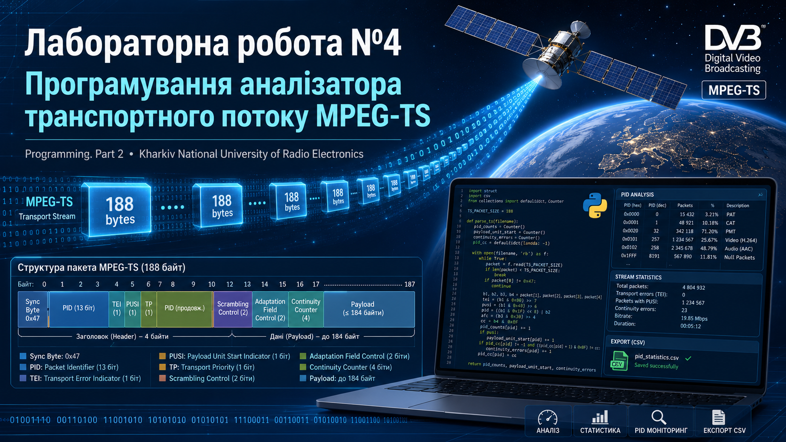

# Laboratory Work No. 4  


##  Project Description

`mpeg_ts_parser.py` reads an MPEG-TS file, splits it into 188-byte transport stream packets, checks synchronization bytes, extracts MPEG-TS header fields, analyzes PID statistics and detects basic continuity counter errors.

The program can be used for educational purposes to demonstrate how digital television transport streams are structured and how binary packet data can be processed in Python.

---

##  Laboratory Work Topic

**Laboratory Work 4. Programming an MPEG-TS Transport Stream Analyzer for Digital Television Systems**

Українською:

**Лабораторна робота №4. Програмування аналізатора транспортного потоку MPEG-TS для цифрового телебачення**

---

## Course Information

**Course:** Programming. Part 2  
**University:** Kharkiv National University of Radio Electronics  
**Author:** Pavlo Galkin  
**Academic years:** 2025–2026  
**Language:** Python 3  

---

##  Features

- Reading MPEG-TS files in binary mode
- Processing packets with a fixed size of 188 bytes
- Checking MPEG-TS synchronization byte `0x47`
- Extracting MPEG-TS packet header fields
- Detecting packet identifiers, or PID values
- Counting packets for each PID
- Detecting transport error indicators
- Detecting basic continuity counter errors
- Identifying known service PIDs
- Saving PID statistics to a CSV file

---

##  MPEG-TS Packet Basics

An MPEG-TS stream consists of fixed-length packets.

Each packet has a size of:

```text
188 bytes
